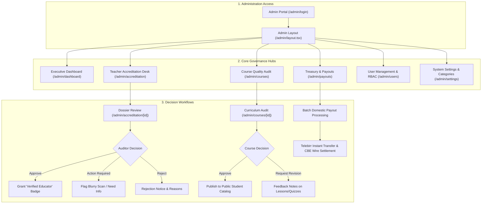

# 🛡️ Asquala Admin & Academic Governance Platform — Master Blueprint

> **System**: Asquala Online Learning Platform  
> **Module**: Admin Console, Teacher Accreditation Review Desk & Academic Quality Audit  
> **Target Framework**: Next.js 16 (App Router), Tailwind CSS v4, Lucide Icons, Zustand  
> **Design Theme**: Light-mode only, Deep Emerald Green (`#047857`), Slate Neutrals, Zero Blue  

---

## 1. Executive Mission & Strategic Governance

Asquala differentiates itself across Ethiopia by maintaining strict educational rigor. The **Admin & Academic Governance Platform** serves as the central control plane for:
1. **Evidence-Based Teacher Accreditation**: Rigorous audit of applicant credentials, university diplomas, software engineering experience, and technical certifications.
2. **Course Quality Auditing**: Pre-publication verification of curricula, lecture videos, milestone assessments, and ETB pricing before courses become publicly discoverable.
3. **Financial Treasury Management**: Approval and domestic settlement of teacher royalty payouts via **Telebirr** and **Commercial Bank of Ethiopia (CBE)**, along with platform fee tracking (15% infrastructure cut).
4. **User & Academic Role Administration**: Role-based access control (RBAC) across Students, Educators, Academic Reviewers, and Super Admins.

---

## 2. Design System & Aesthetic Foundation

The Admin Console adheres strictly to Asquala's brand design standards:

| Token | Hex / Value | Semantic Context |
| :--- | :--- | :--- |
| `var(--primary)` | `#047857` (Emerald 700) | Primary CTA buttons, approved badges, active navigation |
| `var(--primary-hover)` | `#065f46` (Emerald 800) | Interactive hover states |
| `var(--primary-light)` | `#ecfdf5` (Emerald 50) | Card highlight backgrounds, approved badge fills |
| `var(--primary-border)`| `#a7f3d0` (Emerald 200) | Active pill borders, verified badges |
| `var(--card)` | `#ffffff` (Pure White) | Card surfaces, modal dialogs, drawers |
| `var(--secondary)` | `#f1f5f9` (Slate 100) | Input containers, table header backgrounds |
| `var(--border)` | `#e2e8f0` (Slate 200) | Dividers, subtle borders, data table gridlines |
| `var(--foreground)` | `#0f172a` (Slate 900) | Primary body text, table headers |
| `var(--muted-foreground)`| `#64748b` (Slate 500) | Helper notes, timestamps, secondary metadata |

### Administrative Accent Highlights
* **Pending / Review Warning**: Amber `#d97706` / Amber Light `#fef3c7` / Border `#fde68a`
* **Action Required / Alert**: Rose `#e11d48` / Rose Light `#ffe4e6` / Border `#fecdd3`
* **Verified / Approved**: Emerald `#047857` / Emerald Light `#ecfdf5` / Border `#a7f3d0`
* **Strict Constraint**: Zero blue accents or default framework blues.

---

## 3. High-Level Architecture & User Flow

---

## 4. Phase-by-Phase Roadmap

### Phase 1: Admin Layout Shell & Route Isolation
* **Target Files**:
  * `asquala-online-school/stores/admin-ui-store.ts` (sidebar collapse, drawer, active filters)
  * `asquala-online-school/components/admin/layout/admin-sidebar.tsx`
  * `asquala-online-school/components/admin/layout/admin-header.tsx`
  * `asquala-online-school/components/admin/layout/admin-mobile-nav.tsx`
  * `asquala-online-school/app/admin/layout.tsx`
  * `asquala-online-school/app/admin/login/page.tsx`
* **Capabilities**:
  * Branded sidebar with `/images/logo.png` and collapsible navigation (`w-64` ⇄ `w-20`).
  * Admin role indicator ("Super Administrator & Academic Auditor").
  * System health pill and pending action counters.
  * Portal switcher to quickly jump to the Student and Teacher studios.

### Phase 2: Executive Dashboard & Platform KPIs
* **Target Files**:
  * `asquala-online-school/components/admin/dashboard/admin-kpi-grid.tsx`
  * `asquala-online-school/components/admin/dashboard/pending-approvals-feed.tsx`
  * `asquala-online-school/components/admin/dashboard/revenue-take-chart.tsx`
  * `asquala-online-school/components/admin/dashboard/platform-audit-log.tsx`
  * `asquala-online-school/app/admin/dashboard/page.tsx`
* **Capabilities**:
  * Platform KPIs: Total Marketplace Volume (`ETB 2,480,000`), Platform Fee Revenue (`ETB 372,000`), Active Students (`8,940`), Verified Instructors (`48`), Pending Dossiers (`6`), Courses in Audit (`4`).
  * Live alert feed of urgent teacher accreditation requests and course publication submissions.

### Phase 3: Teacher Accreditation & Evidence Review Desk
* **Target Files**:
  * `asquala-online-school/types/admin.ts`
  * `asquala-online-school/lib/mock-admin-data.ts`
  * `asquala-online-school/components/admin/accreditation/accreditation-filters.tsx`
  * `asquala-online-school/components/admin/accreditation/applicant-card.tsx`
  * `asquala-online-school/components/admin/accreditation/dossier-viewer.tsx`
  * `asquala-online-school/components/admin/accreditation/audit-action-modal.tsx`
  * `asquala-online-school/app/admin/accreditation/page.tsx`
  * `asquala-online-school/app/admin/accreditation/[id]/page.tsx`
* **Capabilities**:
  * Tabbed filter queue: *Pending Review* (urgent), *Action Required*, *Approved*, *Rejected*.
  * Interactive Dossier Viewer: Reviewing degree diplomas (AAiT, AASTU), transcripts, CVs, AWS/CKA certifications, and sample lecture videos.
  * Audit Decision Panel: "Approve as Verified Educator", "Request Document Resubmission", or "Reject Application".

### Phase 4: Course Publishing & Academic Quality Audit
* **Target Files**:
  * `asquala-online-school/components/admin/courses/course-audit-table.tsx`
  * `asquala-online-school/components/admin/courses/curriculum-audit-viewer.tsx`
  * `asquala-online-school/components/admin/courses/course-decision-modal.tsx`
  * `asquala-online-school/app/admin/courses/page.tsx`
  * `asquala-online-school/app/admin/courses/[id]/page.tsx`
* **Capabilities**:
  * Reviewing submitted courses: syllabus integrity, video lecture completeness, milestone quizzes, passing score thresholds, and ETB pricing tiers.
  * Direct "Approve & Publish to Marketplace" or "Request Changes" with timestamped review feedback.

### Phase 5: Financial Treasury & Payout Settlement
* **Target Files**:
  * `asquala-online-school/components/admin/payouts/payout-summary-cards.tsx`
  * `asquala-online-school/components/admin/payouts/pending-payouts-table.tsx`
  * `asquala-online-school/components/admin/payouts/process-payout-modal.tsx`
  * `asquala-online-school/components/admin/payouts/fee-reconciliation-card.tsx`
  * `asquala-online-school/app/admin/payouts/page.tsx`
* **Capabilities**:
  * Processing Telebirr mobile wallet and Commercial Bank of Ethiopia (CBE) payout requests.
  * Batch confirmation, reference ID tracking, and transaction clearance.

### Phase 6: User Management & Role-Based Access Control
* **Target Files**:
  * `asquala-online-school/components/admin/users/user-directory-table.tsx`
  * `asquala-online-school/components/admin/users/user-role-badge.tsx`
  * `asquala-online-school/components/admin/users/user-details-drawer.tsx`
  * `asquala-online-school/app/admin/users/page.tsx`
* **Capabilities**:
  * Full platform user directory with filtering across Students, Teachers, Auditors, and Super Admins.
  * Account actions: suspend, reactivate, change roles, audit activity history.

### Phase 7: System Taxonomy, Categories & Security Audit Logs
* **Target Files**:
  * `asquala-online-school/components/admin/settings/category-manager.tsx`
  * `asquala-online-school/components/admin/settings/platform-split-form.tsx`
  * `asquala-online-school/components/admin/settings/security-audit-table.tsx`
  * `asquala-online-school/app/admin/settings/page.tsx`
* **Capabilities**:
  * Managing software categories, platform fee percentages, and system security event logs.

---

## 5. Verification & Quality Gates

* **Zero Build Errors**: Run `export PATH=/home/eaglex/.config/nvm/versions/node/v24.20.0/bin:$PATH && npx tsc --noEmit` after every milestone.
* **Route Isolation**: Administrative layout must isolate standalone `/admin/login` from the internal management dashboard.
* **Palette Strictness**: Deep Emerald Green (`#047857`) brand accents, slate neutrals, and strictly no generic blue styles.
