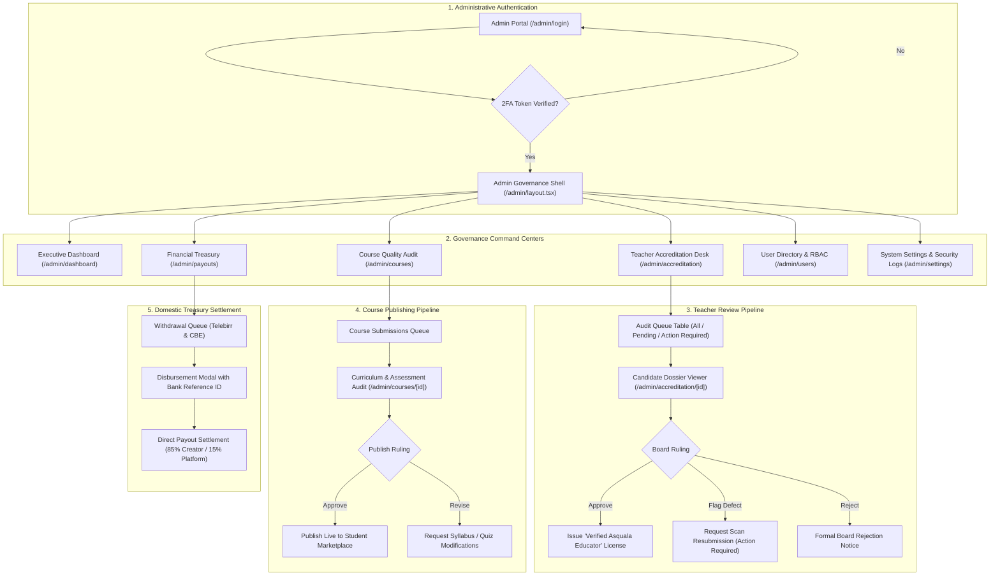

# 🛡️ Asquala Admin & Academic Governance Platform — Master Blueprint & Implementation Plan

> **System**: Asquala Online Learning Platform  
> **Module**: Admin Console, Teacher Accreditation Review Desk & Academic Governance  
> **Target Framework**: Next.js 16 (App Router), Tailwind CSS v4, Lucide Icons, Zustand  
> **Visual Theme**: Strictly Light Mode, Deep Emerald Green (`#047857`), Slate Neutrals, Zero Blue  
> **Documentation Version**: 1.0.0 Production Architecture  

---

## 1. Executive Mission & Institutional Mandate

Asquala's mission is to provide rigorous, accredited online education tailored to Ethiopian students, software engineers, and university learners. To protect students from sub-standard training and ensure instructional excellence, Asquala enforces an **institutional quality barrier**:

```text
┌────────────────────────────────────────────────────────────────────────────────────────┐
│                               ASQUALA QUALITY MANDATE                                  │
│                                                                                        │
│   [ Prospective Teacher ]                                                              │
│             │                                                                          │
│             ▼                                                                          │
│   1. Submits Degrees, Transcripts, CV & Professional Certifications                   │
│             │                                                                          │
│             ▼                                                                          │
│   2. Academic Review Board audits diploma scans (AAiT, AASTU, AAU, JU)                 │
│             │                                                                          │
│             ├── [ Action Required ] ➔ Candidate re-uploads legible registrar scans    │
│             ├── [ Rejected ]        ➔ Detailed institutional justification             │
│             └── [ Approved ]        ➔ "Verified Asquala Educator" license issued       │
│                                                                                        │
│   [ Approved Teacher Authors Course ]                                                  │
│             │                                                                          │
│             ▼                                                                          │
│   3. Curriculum Board audits syllabus, video completeness, quizzes & ETB pricing       │
│             │                                                                          │
│             └── [ Approved ]        ➔ Published to Live Student Marketplace            │
│                                                                                        │
│   [ Course Tuition Monetization ]                                                      │
│             │                                                                          │
│             ▼                                                                          │
│   4. Financial Treasury approves domestic payouts via Telebirr & CBE (85% net split)  │
└────────────────────────────────────────────────────────────────────────────────────────┘
```

The **Admin Interface** is the central command plane for the Academic Board, Quality Assurance Directors, and Financial Officers to execute these governance mandates.

---

## 2. Design System & Visual Specification

The Admin Console follows the exact light-mode palette and token architecture established across Asquala:

| Design Token | CSS Custom Property | Exact Hex / HSL | Purpose in Admin UI |
| :--- | :--- | :--- | :--- |
| **Primary Brand** | `var(--primary)` | `#047857` (Emerald 700) | Primary CTA buttons, verified badges, active tabs |
| **Primary Hover** | `var(--primary-hover)` | `#065f46` (Emerald 800) | Button hover & active click states |
| **Primary Light** | `var(--primary-light)` | `#ecfdf5` (Emerald 50) | Card highlight fills, verified status fills |
| **Primary Border** | `var(--primary-border)`| `#a7f3d0` (Emerald 200) | Badge strokes, active tab borders |
| **Card Surface** | `var(--card)` | `#ffffff` (Pure White) | Elevated panels, modal dialogs, slide-overs |
| **Container Muted**| `var(--secondary)` | `#f1f5f9` (Slate 100) | Input containers, table headers, tag fills |
| **Border Divider** | `var(--border)` | `#e2e8f0` (Slate 200) | Table gridlines, card borders, dividers |
| **Foreground Text**| `var(--foreground)` | `#0f172a` (Slate 900) | High-contrast typography, table data |
| **Muted Metadata** | `var(--muted-foreground)`| `#64748b` (Slate 500) | Subtext, timestamps, helper labels |

### Governance Accent Rules:
* **Pending / Review Warning**: Amber (`#d97706` / bg `#fef3c7` / border `#fde68a`) for items awaiting board audit.
* **Action Required / Defect**: Rose (`#e11d48` / bg `#ffe4e6` / border `#fecdd3`) for flagged scans or missing evidence.
* **Approved / Accredited**: Emerald (`#047857` / bg `#ecfdf5` / border `#a7f3d0`) for verified educators and published courses.
* **Zero Blue Rule**: Strictly avoids default framework blues in favor of curated emerald, slate, and amber tones.
* **Official Branding**: Embeds `/images/logo.png` across all authentication screens, headers, and navigation drawers.

---

## 3. High-Level Architecture & User Journey



---

## 4. Phase-by-Phase Implementation Roadmap

The implementation of the Admin Governance Platform is strictly partitioned into **7 sequential phases**. Each phase has dedicated planning documentation and verification criteria:

| Phase | Module | Route | Key Deliverables | Status | Detailed Plan |
| :---: | :--- | :--- | :--- | :---: | :--- |
| **1** | **Admin Auth & Governance Shell** | `/admin/login`<br>`/admin/layout.tsx` | Dedicated 2FA login, route isolation, collapsible branded sidebar (`w-64` ⇄ `w-20`), mobile drawer, state store | ✅ **Done** | [01-admin-auth-shell.md](file:///home/eaglex/Documents/officials/Asquala-online-learning-platform/docs/plan/admin-interface/01-admin-auth-shell.md) |
| **2** | **Executive Dashboard & KPIs** | `/admin/dashboard` | Marketplace GMV (`ETB 2.48M`), 15% take-rate revenue, active students, pending audit queue widgets, live activity feed | ⏳ Planned | [02-executive-dashboard.md](file:///home/eaglex/Documents/officials/Asquala-online-learning-platform/docs/plan/admin-interface/02-executive-dashboard.md) |
| **3** | **Teacher Accreditation Desk** | `/admin/accreditation`<br>`/admin/accreditation/[id]` | Filterable queue (*Pending*, *Action Required*, *Approved*), 4-tab dossier viewer (Degrees, Experience, Certs, Identity), ruling modal | ⏳ Planned | [03-teacher-accreditation-desk.md](file:///home/eaglex/Documents/officials/Asquala-online-learning-platform/docs/plan/admin-interface/03-teacher-accreditation-desk.md) |
| **4** | **Course Quality & Publishing Audit**| `/admin/courses`<br>`/admin/courses/[id]` | Pre-publication audit table, syllabus breakdown, lesson inspection, milestone quiz passing threshold audit, 85/15 ETB split check | ⏳ Planned | [04-course-quality-audit.md](file:///home/eaglex/Documents/officials/Asquala-online-learning-platform/docs/plan/admin-interface/04-course-quality-audit.md) |
| **5** | **Treasury & Domestic Payouts** | `/admin/payouts` | Telebirr mobile wallet & CBE wire settlement queue, batch confirmation modal with transaction ref IDs, ledger reconciliation | ⏳ Planned | [05-treasury-payouts.md](file:///home/eaglex/Documents/officials/Asquala-online-learning-platform/docs/plan/admin-interface/05-treasury-payouts.md) |
| **6** | **User Management & RBAC** | `/admin/users` | Directory of students, instructors, auditors, and admins; role badge rendering; account suspension & reactivation triggers | ⏳ Planned | [06-user-management-rbac.md](file:///home/eaglex/Documents/officials/Asquala-online-learning-platform/docs/plan/admin-interface/06-user-management-rbac.md) |
| **7** | **System Taxonomy & Security Logs** | `/admin/settings` | Curriculum discipline manager, platform take-rate form (default 85/15), cryptographic audit ledger table | ⏳ Planned | [07-taxonomy-security-audit.md](file:///home/eaglex/Documents/officials/Asquala-online-learning-platform/docs/plan/admin-interface/07-taxonomy-security-audit.md) |

---

## 5. Verification & Quality Gates

Each phase must satisfy the following criteria before moving to the next:
1. **Type Safety**: Pass `export PATH=/home/eaglex/.config/nvm/versions/node/v24.20.0/bin:$PATH && npx tsc --noEmit` with **0 errors**.
2. **Visual Fidelity**: Pure light mode, deep emerald branding (`#047857`), slate neutrals, zero blue accents, responsive layout on desktop, tablet, and mobile.
3. **Interactive Completeness**: All modals, filters, tabs, and status toggles must reactively update local state and provide clear user feedback.
4. **Domestic Alignment**: Direct support for Ethiopian university accreditations (AAiT, AASTU), Telebirr mobile wallets, and Commercial Bank of Ethiopia (CBE) wire transfers in Ethiopian Birr (`ETB`).
