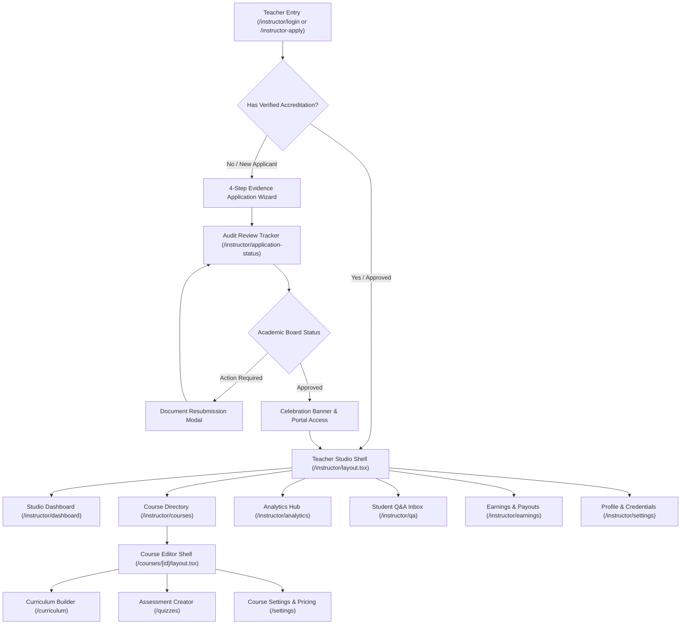

# 🎓 Asquala — Teacher & Instructor Studio Architecture Summary

> **Scope**: Comprehensive architectural, functional, and technical summary of the **Teacher & Instructor Interface, Accreditation System, and Creator Studio** on the Asquala Online Learning Platform.

---

## 1. Executive Summary & Accreditation Mandate

Asquala is dedicated to delivering high-caliber, accredited technical education across Ethiopia. To safeguard instructional rigor and ensure students receive market-ready competencies, the platform enforces an **evidence-based accreditation barrier**:

1. **Dedicated Teacher Authentication**: Instructors authenticate through a specialized portal (`/instructor/login`) distinct from the general student sign-in.
2. **Mandatory Accreditation Dossier**: Aspiring teachers must submit documentary evidence across 4 sequential stages:
   - **Personal & Professional Identity**: Legal name, contact details, headline, biography, and professional links (LinkedIn, GitHub, portfolio).
   - **Academic Credentials**: University degrees, accredited institutions (e.g. AAiT, AASTU), fields of study, and certified diploma/transcript PDF scans.
   - **Work & Teaching Experience**: Production software engineering background, public/private sector organizations, years of experience, and prior university lecturing or mentorship roles.
   - **Professional Certifications**: Verified cloud, networking, or systems accreditations (AWS Solutions Architect, CKA, Cisco) with credential IDs and certificate scans.
3. **Academic Board Review Gate**: Applications enter a 4-stage audit timeline (`Submitted` ➔ `Document Verification` ➔ `Academic Review` ➔ `Final Decision`). Only approved instructors unlock course authoring, tuition monetization, and public student instruction.

---

## 2. Design System & Aesthetic Standards

The interface adheres strictly to Asquala's modern design specifications:
* **Strict Light Mode**: Tailored for readability and accessibility in bright classroom and office environments.
* **Curated Emerald Palette**: Deep Emerald Green primary (`#047857`, `var(--primary)`), hover state (`#065f46`, `var(--primary-hover)`), emerald tint (`#ecfdf5`, `var(--primary-light)`), and subtle emerald border (`#a7f3d0`, `var(--primary-border)`).
* **Zero Blue Colors**: Eliminates generic blue UI buttons, links, or backgrounds in favor of emerald green and slate neutrals.
* **Official Brand Identity**: The official logo at `/images/logo.png` is embedded across all headers, authentication screens, and collapsible sidebars.
* **Strict CSS Custom Properties**: All components utilize global CSS tokens (`var(--card)`, `var(--secondary)`, `var(--border)`, `var(--muted-foreground)`), preventing style drift.

---

## 3. End-to-End Workflow Architecture

---

## 4. Phase-by-Phase Technical Deliverables

### Phase 1: Teacher Auth & Evidence Application Wizard
* **Target Routes**: [`/instructor/login`](file:///home/eaglex/Documents/officials/Asquala-online-learning-platform/asquala-online-school/app/instructor/login/page.tsx) and [`/instructor-apply`](file:///home/eaglex/Documents/officials/Asquala-online-learning-platform/asquala-online-school/app/(auth)/instructor-apply/page.tsx)
* **Key Components**:
  - `DocumentUploadZone`: Drag-and-drop file upload component supporting PDF and image certificate uploads with size validation and removal triggers.
  - `ApplicationStepper`: 4-stage stepper tracking progress across Personal Profile, Education, Experience, and Certifications.
  - `StepPersonalProfile`: Full legal name, email, phone, headline, bio, and social links.
  - `StepEducationEvidence`: Degree level, university, graduation year, and transcript attachment.
  - `StepWorkExperience`: Role, organization, years of experience, teaching indicator, and responsibilities.
  - `StepCertificationsCourse`: Certifications with credential IDs, subject focus, target audience, and sample video link.

### Phase 2: Teacher Application Review & Status Tracker
* **Target Route**: [`/instructor/application-status`](file:///home/eaglex/Documents/officials/Asquala-online-learning-platform/asquala-online-school/app/instructor/application-status/page.tsx)
* **Key Components**:
  - `ReviewTimelineStepper`: 4-step progress tracker (*Submitted* ➔ *Document Verification* ➔ *Academic Review* ➔ *Final Decision*).
  - `SubmittedDossierCard`: Tabbed explorer allowing instructors to review all submitted university degrees, employment records, and certificate PDFs.
  - `ActionRequiredBanner`: Alert banner highlighting audit feedback from reviewers (e.g., blurry transcript scans).
  - `DocumentResubmitModal`: Direct file upload dialog enabling instant resolution of missing or flagged documents.
  - `ApprovalCelebrationCard`: Confetti-styled celebration card unlocking direct entry to the Creator Studio upon accreditation.

### Phase 3: Teacher Studio Shell & Navigation
* **Target Layout**: [`app/instructor/layout.tsx`](file:///home/eaglex/Documents/officials/Asquala-online-learning-platform/asquala-online-school/app/instructor/layout.tsx)
* **State Management**: [`stores/instructor-ui-store.ts`](file:///home/eaglex/Documents/officials/Asquala-online-learning-platform/asquala-online-school/stores/instructor-ui-store.ts) (managing desktop sidebar collapse `w-64` ⇄ `w-20` and mobile drawer state).
* **Key Components**:
  - `InstructorSidebar`: Branded sidebar with `/images/logo.png`, navigation items with active emerald indicators, and a quick "Switch to Student Portal" action.
  - `InstructorHeader`: Global studio header with "+ New Course" button, monthly revenue pill (`ETB 38,400 • +18%`), Q&A notification bell, and user menu.
  - `InstructorUserDropdown`: User profile menu with quick links to accreditation settings and logout.
  - `InstructorMobileNav`: Responsive drawer navigation for tablets and mobile devices.

### Phase 4: Teacher Studio Dashboard
* **Target Route**: [`/instructor/dashboard`](file:///home/eaglex/Documents/officials/Asquala-online-learning-platform/asquala-online-school/app/instructor/dashboard/page.tsx)
* **Key Components**:
  - `StudioKpiCard`: 4 primary metrics: Lifetime Revenue (`ETB 148,600`), Active Students (`1,420`), Instructor Rating (`4.9 ★`), and Published Courses (`4`).
  - `TopCoursesOverview`: Catalog cards displaying enrollments, student ratings, and quick links to course editors.
  - `PendingQaAlert`: Priority alert banner calling attention to unresolved student questions in active courses.
  - `RecentEnrollmentsFeed`: Real-time feed of recent student enrollments across Ethiopian universities.
  - `StudioQuickActions`: Shortcuts for creating courses, managing payouts, and reviewing analytics.

### Phase 5: Course Management & Directory
* **Target Route**: [`/instructor/courses`](file:///home/eaglex/Documents/officials/Asquala-online-learning-platform/asquala-online-school/app/instructor/courses/page.tsx)
* **Key Components**:
  - `CourseStatusTabs`: Filter tabs (*All*, *Published*, *Drafts*, *Under Review*, *Archived*) with live counts.
  - `CourseSearchBar`: Debounced keyword and category search filter.
  - `InstructorCourseCard`: Rich course cards with 16:9 thumbnails, Ethiopian Birr pricing badges, enrolled student counters, lesson counts, and shortcuts to Curriculum, Quizzes, Settings, and Student Previews.
  - `CourseEmptyState`: Filter clearing and course creation prompts.
  - [`/instructor/courses/create`](file:///home/eaglex/Documents/officials/Asquala-online-learning-platform/asquala-online-school/app/instructor/courses/create/page.tsx): Fast-track creation modal for new course initiatives.

### Phase 6: Interactive Curriculum & Lesson Builder
* **Target Route**: [`/instructor/courses/[courseId]/curriculum`](file:///home/eaglex/Documents/officials/Asquala-online-learning-platform/asquala-online-school/app/instructor/courses/[courseId]/curriculum/page.tsx)
* **Sub-Navigation Layout**: [`app/instructor/courses/[courseId]/layout.tsx`](file:///home/eaglex/Documents/officials/Asquala-online-learning-platform/asquala-online-school/app/instructor/courses/%5BcourseId%5D/layout.tsx) providing persistent course banner and tabs between **Curriculum**, **Quizzes**, and **Settings**.
* **Key Components**:
  - `CurriculumTopBar`: Real-time autosave status indicator (`"All changes saved"`, `"Saving..."`), curriculum statistics (`{M} Modules • {L} Lessons • {H}h`), expand/collapse toggles, and `+ Add Module` button.
  - `CurriculumModuleItem`: Accordion module container with inline title renaming, up/down sequence reordering, duration aggregations, and delete confirmations.
  - `CurriculumLessonItem`: Lesson cards with order badges (`1.1`, `1.2`), type badges (**Video**, **Reading**, **Quiz**), durations, "Free Preview" toggle pills, edit triggers, and delete actions.
  - `AddModuleModal`: Dialog to create sequential course modules with learning objectives.
  - `AddLessonModal`: 3-card selector for Video Lecture, Reading Guide, and Milestone Quiz with title, duration, and preview options.
  - `LessonEditorDrawer`: Slide-over editor for video embed links, live markdown article editing with formatted previews, quiz milestone settings, and downloadable asset attachments (PDF, source code ZIP, GitHub).

### Phase 7: Course Settings & Pricing
* **Target Route**: [`/instructor/courses/[courseId]/settings`](file:///home/eaglex/Documents/officials/Asquala-online-learning-platform/asquala-online-school/app/instructor/courses/[courseId]/settings/page.tsx)
* **Key Components**:
  - `CourseBasicInfoForm`: Title, subtitle, category, difficulty level, teaching language, full course overview, and completion certificate toggles.
  - `CourseMediaUploader`: 16:9 cover thumbnail preview with technical preset options and promotional teaser video link test.
  - `LearningOutcomesEditor`: Dynamic tag manager for 4–8 concrete learning outcomes and foundational course prerequisites.
  - `CoursePricingCard`: Free vs. Paid toggle, Ethiopian Birr (ETB) pricing tiers (`800 ETB`, `1,200 ETB`, `1,800 ETB`, `2,500 ETB`, `3,500 ETB`), with automated creator revenue calculations (**85% Instructor Net Payout / 15% Platform Infrastructure Fee**).
  - `CoursePublishPanel`: Pre-publication academic review checklist and "Submit for Academic Review" confirmation dialog.

### Phase 8: Assessment & Quiz Creator
* **Target Route**: [`/instructor/courses/[courseId]/quizzes`](file:///home/eaglex/Documents/officials/Asquala-online-learning-platform/asquala-online-school/app/instructor/courses/[courseId]/quizzes/page.tsx)
* **Key Components**:
  - `QuizConfigCard`: Assessment title, module mapping, countdown timer in minutes, and passing threshold slider (default 80%).
  - `QuestionEditorItem`: Stepped question card with editable prompts, optional syntax-highlighted code block, 4 multiple-choice options (A, B, C, D) with single correct answer radio selector, and pedagogical solution rationale.
  - `CodeSnippetInput`: Monospace technical snippet input with language selector (TypeScript, SQL, Bash, Python) and one-click copy.
  - `AddQuestionModal`: Modal dialog for creating new assessment questions with validation.
  - `QuizPreviewModal`: Interactive student test runner simulation allowing instructors to experience the exam with live scoring, instant feedback, and pass/fail evaluation.

### Phase 9: Student Analytics & Course Insights
* **Target Route**: [`/instructor/analytics`](file:///home/eaglex/Documents/officials/Asquala-online-learning-platform/asquala-online-school/app/instructor/analytics/page.tsx)
* **Key Components**:
  - `EnrollmentTrendCard`: Monthly enrollment bar chart (May–Oct 2026) with revenue tooltips and Ethiopian regional breakdown (Addis Ababa 56%, Hawassa 14%, Bahir Dar 12%, Jimma 11%, Mekelle/Dire Dawa 7%).
  - `CurriculumDropoffFunnel`: Module-by-module completion funnel identifying student friction points and pedagogical optimization tips.
  - `AssessmentStatsCard`: First-attempt pass rates, certificates issued, and top 3 concepts with highest student error rates.
  - `StudentReviewsFeed`: Filterable reviews list (5★, 4★, 3★) with inline instructor response publisher.

### Phase 10: Student Q&A Discussion Inbox
* **Target Route**: [`/instructor/qa`](file:///home/eaglex/Documents/officials/Asquala-online-learning-platform/asquala-online-school/app/instructor/qa/page.tsx)
* **Key Components**:
  - `QaInboxSidebar`: Split-screen left pane with *Needs Reply*, *All*, and *Resolved* filters, keyword search, course filter, and unread pulse indicators.
  - `QaQuestionThread`: Question details with exact lesson origin (e.g. `Lesson 1.2 at 08:42`), code snippet blocks, and existing responses.
  - `QaReplyComposer`: Markdown response composer with "Mark as Official Solution" badge and quick template snippets.
  - `QaEmptyState`: Celebratory "Inbox Zero" empty state.

### Phase 11: Earnings & Domestic Payout Management
* **Target Route**: [`/instructor/earnings`](file:///home/eaglex/Documents/officials/Asquala-online-learning-platform/asquala-online-school/app/instructor/earnings/page.tsx)
* **Key Components**:
  - `EarningsSummaryCards`: Available Balance (`ETB 24,800`), Pending Clearance (`ETB 13,600`), and Lifetime Revenue (`ETB 148,600`).
  - `PayoutMethodsManager`: Manager for **Telebirr Mobile Wallet** and **Commercial Bank of Ethiopia (CBE)** accounts.
  - `RequestPayoutModal`: Withdrawal modal with quick percentage buttons (25%, 50%, 100%), destination picker, and immediate ledger settlement.
  - `PayoutHistoryTable`: Historical transaction ledger with reference IDs, status badges (`Completed`, `Processing`), and tax receipt downloads.
  - `RevenueBreakdownChart`: Transparent 85% / 15% revenue model breakdown card.

### Phase 12: Public Profile & Teaching Credentials
* **Target Route**: [`/instructor/settings`](file:///home/eaglex/Documents/officials/Asquala-online-learning-platform/asquala-online-school/app/instructor/settings/page.tsx)
* **Key Components**:
  - `InstructorProfileForm`: Headshot photo uploader, full legal name, professional headline, biography, and portfolio/social links.
  - `VerifiedCredentialsCard`: **"Verified Asquala Educator"** accreditation card showcasing verified university degrees (AAiT, AASTU) and professional certifications (AWS, CKA).
  - `SubmitNewCredentialModal`: Dialog to submit additional degrees or industry accreditations with document scans.
  - `StudioNotificationsForm`: Fine-grained switches for enrollment alerts, Q&A notifications, and Telebirr payout SMS alerts.

---

## 5. Complete File-to-Functionality Mapping

| File Path | Functional Role | Key Implementation Highlights |
|---|---|---|
| [`types/instructor.ts`](file:///home/eaglex/Documents/officials/Asquala-online-learning-platform/asquala-online-school/types/instructor.ts) | Core Type Definitions | `InstructorApplication`, `EducationRecord`, `ExperienceRecord`, `CertificateRecord`, `InstructorCourseItem`, `CourseSettingsData`, and `InstructorStatKPIs`. |
| [`lib/mock-instructor-data.ts`](file:///home/eaglex/Documents/officials/Asquala-online-learning-platform/asquala-online-school/lib/mock-instructor-data.ts) | Mock & Seeding Engine | Comprehensive mock datasets for applications, courses, curricula, quizzes, analytics, Q&A threads, and payout transactions. |
| [`stores/instructor-ui-store.ts`](file:///home/eaglex/Documents/officials/Asquala-online-learning-platform/asquala-online-school/stores/instructor-ui-store.ts) | Zustand UI Store | Responsive sidebar collapse (`w-64` ⇄ `w-20`) and mobile drawer visibility state. |
| [`app/instructor/layout.tsx`](file:///home/eaglex/Documents/officials/Asquala-online-learning-platform/asquala-online-school/app/instructor/layout.tsx) | Studio Root Layout | Route isolation: renders standalone layout for `/login`, `/apply`, and `/application-status`; full Studio Shell for creator pages. |
| [`components/instructor/layout/instructor-sidebar.tsx`](file:///home/eaglex/Documents/officials/Asquala-online-learning-platform/asquala-online-school/components/instructor/layout/instructor-sidebar.tsx) | Studio Navigation Sidebar | `/images/logo.png`, active route indicators in emerald, collapse toggle, and Student Portal switcher. |
| [`components/instructor/layout/instructor-header.tsx`](file:///home/eaglex/Documents/officials/Asquala-online-learning-platform/asquala-online-school/components/instructor/layout/instructor-header.tsx) | Studio Top Navigation | "+ New Course" button, revenue pill (`ETB 38,400 • +18%`), Q&A bell, and user menu dropdown. |
| [`app/instructor/courses/[courseId]/layout.tsx`](file:///home/eaglex/Documents/officials/Asquala-online-learning-platform/asquala-online-school/app/instructor/courses/%5BcourseId%5D/layout.tsx) | Course Sub-Navigation Shell | Common course banner with sub-navigation tabs bridging Curriculum, Quizzes, and Settings. |
| [`app/instructor/courses/[courseId]/curriculum/page.tsx`](file:///home/eaglex/Documents/officials/Asquala-online-learning-platform/asquala-online-school/app/instructor/courses/%5BcourseId%5D/curriculum/page.tsx) | Curriculum Builder Page | Interactive module accordion reordering, multi-type lesson creator, and autosave indicators. |
| [`app/instructor/courses/[courseId]/settings/page.tsx`](file:///home/eaglex/Documents/officials/Asquala-online-learning-platform/asquala-online-school/app/instructor/courses/%5BcourseId%5D/settings/page.tsx) | Course Settings & Pricing Page | 16:9 thumbnail previews, learning outcomes, ETB pricing splits, and academic review submissions. |
| [`app/instructor/courses/[courseId]/quizzes/page.tsx`](file:///home/eaglex/Documents/officials/Asquala-online-learning-platform/asquala-online-school/app/instructor/courses/%5BcourseId%5D/quizzes/page.tsx) | Quiz Assessment Builder Page | Multiple-choice question editor, code snippet inputs, passing threshold controls, and student simulation runner. |
| [`app/instructor/analytics/page.tsx`](file:///home/eaglex/Documents/officials/Asquala-online-learning-platform/asquala-online-school/app/instructor/analytics/page.tsx) | Student Analytics Hub | Enrollment velocity charts, Ethiopian regional distribution, completion funnels, and review management. |
| [`app/instructor/qa/page.tsx`](file:///home/eaglex/Documents/officials/Asquala-online-learning-platform/asquala-online-school/app/instructor/qa/page.tsx) | Student Q&A Inbox Page | Split-screen workspace for filtering unanswered questions, viewing code snippets, and publishing official solutions. |
| [`app/instructor/earnings/page.tsx`](file:///home/eaglex/Documents/officials/Asquala-online-learning-platform/asquala-online-school/app/instructor/earnings/page.tsx) | Earnings & Payouts Page | Available balance tracking, Telebirr & CBE account settings, withdrawal requests, and historical ledger. |
| [`app/instructor/settings/page.tsx`](file:///home/eaglex/Documents/officials/Asquala-online-learning-platform/asquala-online-school/app/instructor/settings/page.tsx) | Profile & Credentials Page | Public educator bio, verified academic accreditations showcase, credential submissions, and alerts. |

---

## 6. Verification & Quality Assurance

* **TypeScript Compilation**: Executed `export PATH=/home/eaglex/.config/nvm/versions/node/v24.20.0/bin:$PATH && npx tsc --noEmit` — passed with **0 errors**.
* **Responsive Architecture**: Tested across desktop (`1280px+`), tablet (`768px–1024px`), and mobile viewports (`360px–480px`) with dedicated drawer navigation and touch-optimized controls.
* **Component Modularity**: All components are self-contained with explicit prop typing, reusable primitives, and optimistic state updates.
* **Domestic Readiness**: Native integration with Ethiopian Birr (ETB) pricing calculations, Telebirr and CBE payout flows, and Ethiopian regional university context.
